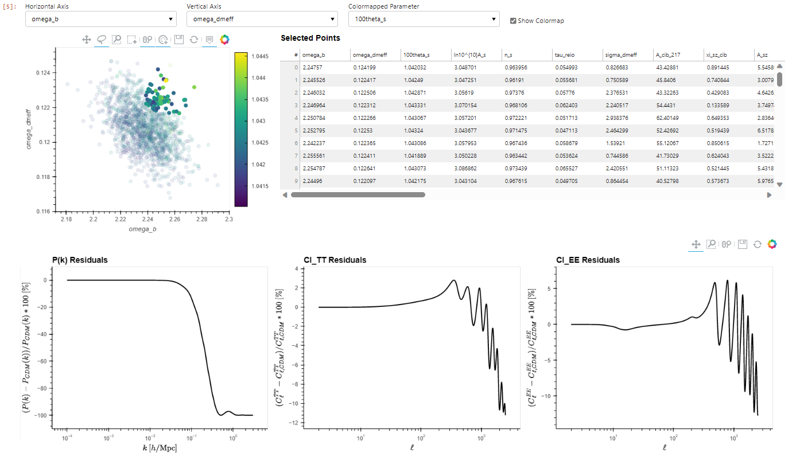

# inviz

This tool helps you explore the results of running MCMC posterior sampling on your cosmological model. Selecting a point on the sample distribution will automatically run CLASS on that sample and display the output. 

## Installation
Installation is straightforward with pip:

    pip install inviz
Or, if you want to test the latest changes, you can clone the repository with
    
    git clone https://github.com/wen-jams/inviz
## Dependencies
Currently, only Python versions $\geq$ 3.7 and $<$ 3.11 are supported.  You will also need the Cosmology Boltzmann code CLASS (either the default or your own modified version). Follow the instructions [here](https://cobaya.readthedocs.io/en/latest/theory_class.html) to install classy, the Python wrapper for CLASS.

## Test Installation
To verify that inviz and all the dependencies have been installed correctly, open a Jupyter Notebook and run:
```python
from inviz import *
hv.extension('bokeh')
pn.extension()
```
If no errors appear, we're ready to start visualizing!

For now, a lot of features are hard-coded to use the testing dataset located in the [data/test_IDM_n_0](data/test_IDM_n_0) folder. These were created using a custom version of CLASS, which we aren't yet ready to release to the public. However, this is theoretically what the code would look like if you want to make your own visualization of the matter power spectrum residuals:
```python
param_names = load_params('data/test_IDM_n_0/2022-05-04_75000_.paramnames')
df = pd.DataFrame(columns=param_names)
for i in trange(1,56):
    temp = load_data('data/test_IDM_n_0/2022-05-04_75000__{}.txt'.format(i), column_names=param_names)
    df = pd.concat([df,temp]).reset_index(drop=True)
df_slice = df[::500]
new_df = df_slice.reset_index(drop=True)
ds = hv.Dataset(new_df, ['omega_b', 'omega_dmeff'])
viz(ds, new_df)
```
And the result should look like this:
